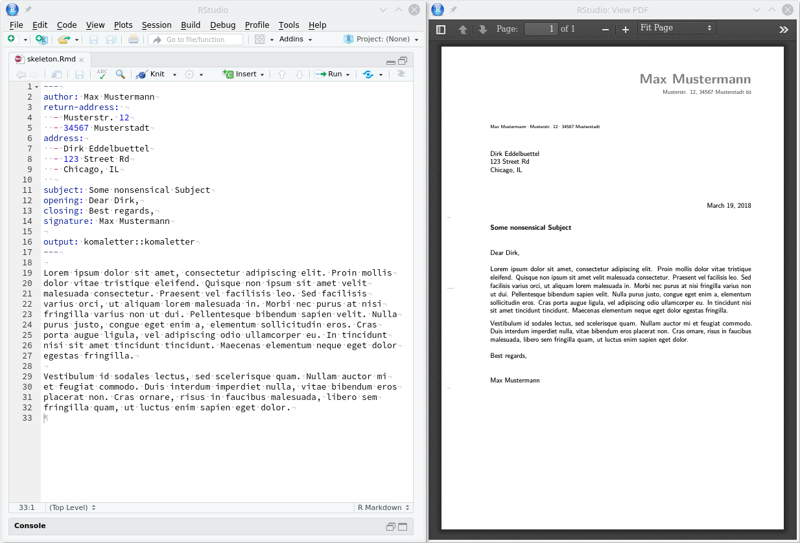
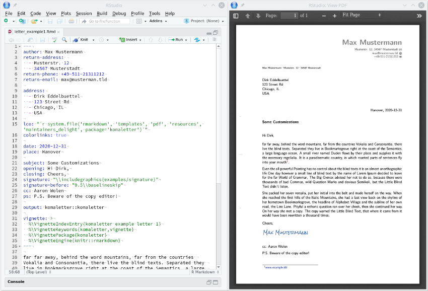

## komaletter: Simply Beautiful PDF Letters from Markdown

[](https://travis-ci.org/rnuske/komaletter) 
[](https://ci.appveyor.com/project/rnuske/komaletter) 
[](https://cloud.drone.io/rnuske/komaletter) 
[](https://www.gnu.org/licenses/gpl-3.0.html) 
[](https://cran.r-project.org/package=komaletter) 
[](https://cran.r-project.org/package=komaletter) 
[](https://doi.org/10.5281/zenodo.1221316)

### Motivation
Simple letters tend to look very much alike. They are either determined by a 
standard eg. window envelope style or writer's preferences. Thus, if the layout
is fix, they lend themselves to be written in R Markdown.

The [KOMA-Script LaTeX Bundle](https://www.komascript.de) provides layouts for
many common window envelope types (German, US, French, Japanese, ...) and the
possibility to define your own layout. The *komaletter* package also provides
it's own default layout loosely based on DIN 5008B.

This package is an adaptation of the
[linl](https://cran.r-project.org/package=linl) package
by Dirk Eddelbuettel and Aaron Wolen for international users. 
linl itself leans on earlier work by Aaron Wolen in his
[pandoc-letter](https://github.com/aaronwolen/pandoc-letter) 
repository and extends it for use from R via the
[rmarkdown](https://cran.r-project.org/package=rmarkdown) package.


### Examples

#### Skeleton
The skeleton provided by `komaletter` creates a very simple letter as a 
starting point for your own writing. Several formatting defaults such as font, 
fontsize, indentation are in use. See `vignette('intro', 'komaletter')` and 
`help(komaletter)` for a complete list and their default values. The following 
figure shows the `rmarkdown` source on the left and the rendered `pdf` on the
right.




#### Vignette
The vignette examples are a are a bit more detailed and show how to include a
signature, choose a different layout and a few format settings.
All of these are driven by simple settings in the `YAML` header as shown on 
the left in the following figure.




### Installation
You can install the released version of **komaletter** from [CRAN](https://CRAN.R-project.org/package=komaletter) with:

``` r
install.packages("komaletter")
```

Install the development version from [GitHub](https://github.com/rnuske/komaletter) with:

``` r
remotes::install_github("rnuske/komaletter")
```


### Usage
To start a new letter you can take advantage of the komaletter skeleton via 
`rmarkdown::draft` or the RStudio menu: File > New File > R Markdown... > 
From Template > komaletter (PDF). 
When finished writing your letter the  RMarkdown document can be compiled to PDF
via `rmarkdown::render` or the RStudio Knit button.

```r
# start a new letter using the provided skeleton
rmarkdown::draft("my_letter.Rmd", template="pdf", package="komaletter", edit=FALSE)

# change my_letter.Rmd to your liking

# turn Rmd into a beautiful PDF
rmarkdown::render("my_letter.Rmd")
```

### Requirements
Beyond the R package dependencies, a working `pandoc` binary and a LaTeX
distribution including KOMA-Script is needed. RStudio installs it's own copy of
`pandoc`, otherwise do what is needed on your OS. For LaTeX look for `texlive`
which is included in most Linux distributions or `MiKTeX` if you are using
Windows. KOMA-Script is part of all but the most bare bone LaTeX distributions.
Something like `sudo apt install pandoc pandoc-citeproc texlive` should provide everything needed on Debian/Ubuntu.

If you plan to write non-english letters, make sure you have the necessary 
language packs, _i.e_ `texlive-lang-german`.

### Authors
Robert Nuske, Dirk Eddelbuettel and Aaron Wolen.


### License
GPL-3 for this package, the work in [pandoc-letter](https://github.com/aaronwolen/pandoc-letter), as well as the underlying Pandoc template.
